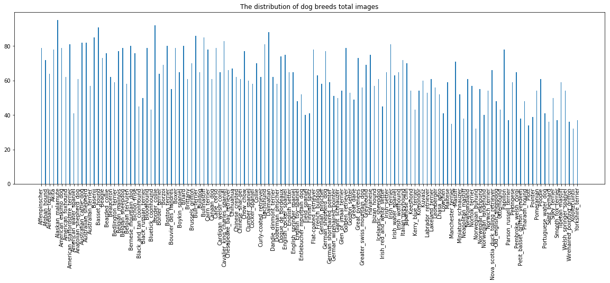
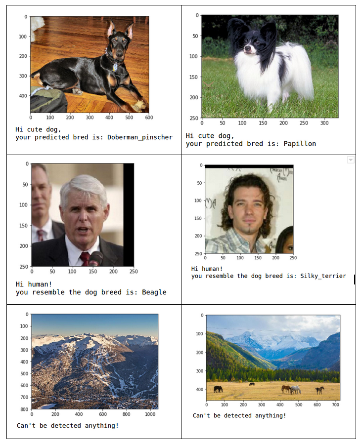

# Dog Breed Classification Using CNN

## Table of Contents
1. [Motivation](#motivation)
2. [Exploratory Data Analysis](#xpoanalysis)
3. [Results](#results)
3. [Project Files](#project_files)
4. [Used Libraries](#libraries)
5. [Acknowleadgments](#acknowledgment)

## Motivation 
The objective of this particular project is to build a Convolutional Neural Network(CNN) model to classify Dog’s breed, and finally the built model is used to deploy in real world applications such as mobile , web or desktop applications. The application will accept any user supplied images as input, and if the model detected it as a dog then the model will predict their breed. Following is the potential output of the built model.

## Exploratory Data Analysis 
The below chart shows the distribution of dog breeds for total images and there are at least 61 images for 50% dog breeds.

## Results 
The model was able to determine whether the image contains a human, dog, or neither. It predicted the correct dog breed for tested dogs.  
  

## Project Files 
* "dog_app.ipynb" is the main Jupyter notebook file. That is including all source code.
* "dog_app.html" is HTML, that can be viewed using any of web browser
* "saved_models" can be used to developed an application to detect dog breeds
* "sample_images" can be used to test the model

## Used Libraries 
* [Keras](https://keras.io/)
* [TensorFlow](https://www.tensorflow.org/)
* [OpenCV](https://opencv.org/)
* [Pandas](https://pandas.pydata.org/)
* [Numpy](https://numpy.org/)
* [Matplotlib](https://matplotlib.org/)
